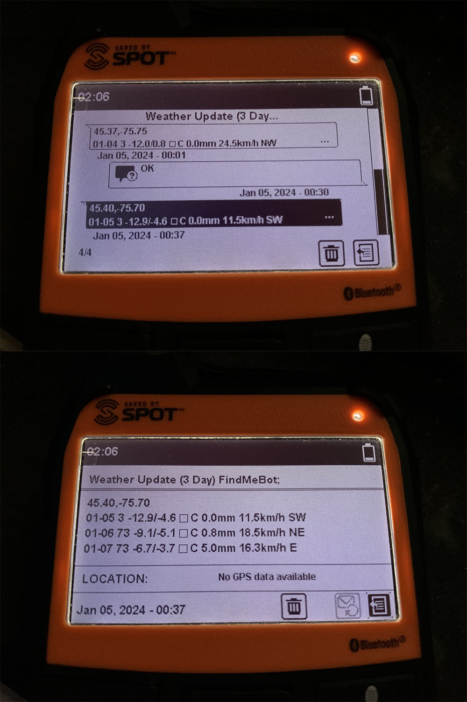

# spotweather
3 days weather forecast tool for findmespot.com SPOT X 2-Way Satellite Messenger


# Demo
Free for use for now, since I use it by myself to fill the gap compare to Garmin, and the infrastructure is very low cost.

Add contact weather@noreply.moegirl.live in Spot X and send any message to the email with coordinate enabled, include predefind message, so free for sending.

You will be charged for sending and/or receiving message based on your spot-x subscription plan.

Please remember to whitelist the email address above in order to receive the weather message.

# Receive format
```
(lat),(lon)
(today's date) (wom weather code) (temperature range) (precipitation) (wind)
(tomorrow) (wom weather code) (temperature range) (precipitation) (wind)
(the day after tomorrow) (wom weather code) (temperature range) (precipitation) (wind)
```

# Sample Received Text
```
45.40,-75.71
01-02 3 -6.3~-0.2°C 0.0mm 16.5km/h SW
01-03 73 -0.7~2.4°C 2.3mm 12.1km/h SW
01-04 73 -7.9~0.0°C 1.6mm 22.0km/h NW
```


please ignore the date, its on Jan 4, some setting got wrong on my spotx

# Reference

WMO-CODE
https://www.nodc.noaa.gov/archive/arc0021/0002199/1.1/data/0-data/HTML/WMO-CODE/WMO4677.HTM

Weather data provider
https://open-meteo.com/
